```{r setup, include = FALSE}
library(tidyverse)
library(RColorBrewer)
library(knitr)
```

<!-- adding bold and italic options -->
<style>
em {
  font-style: italic
}
strong {
  font-weight: bold;
}
</style>

## High throughput sequencing

- First generation sequencing (Sanger)
- Second generation sequencing (Illumina)
- Third generation sequencing (PacBio and Oxford Nanopore)

---

## High throughput sequencing

```{r, out.width = "95%", dpi = 300, echo = FALSE, fig.align = "center"}
  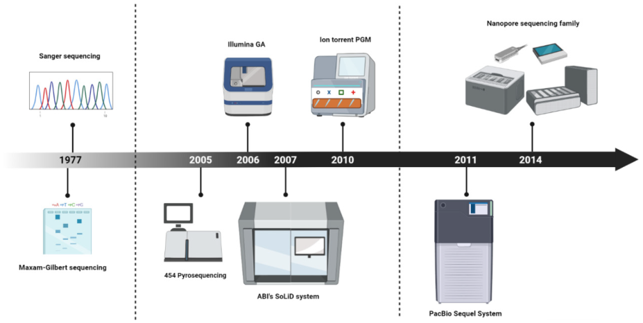
```

---

## High throughput sequencing

```{r, out.width = "95%", dpi = 300, echo = FALSE, fig.align = "center"}
  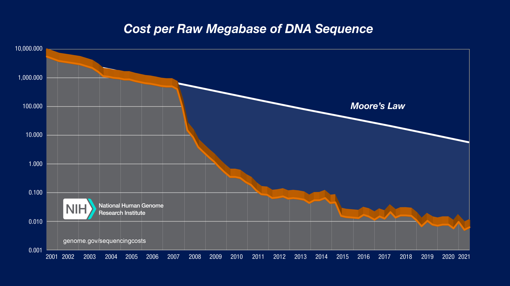
```

--- .segue .dark 

## First generation sequencing

--- bg:white

## Sanger sequencing

```{r, out.width = "60%", dpi = 300, echo = FALSE, fig.align = "center"}
  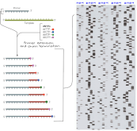
```

--- bg:white

## Sanger sequencing

```{r, out.width = "60%", dpi = 300, echo = FALSE, fig.align = "center"}
  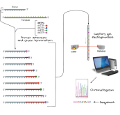
```

--- &twocol

## Sanger overview

*** =left

```{r, out.width = "100%", dpi = 300, echo = FALSE, fig.align = "center"}
  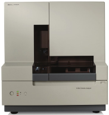
```

*** =right

- 700-1000 bp
- High accuracy
- 384 samples
- 1 day
- Dominated for 3 decades

--- .segue .dark 

## Second generation sequencing

---

## Illumina

```{r, out.width = "100%", dpi = 300, echo = FALSE, fig.align = "center"}
  include_graphics("./assets/img/illumina.svg")
```

---

## Data output

Platform | read pairs | Read length | data output | Genome coverage
---|---|---|---|---
MiniSeq|25 million|2 x 150 bp|7.5 Gb|2 x
MiSeq|25 million|2 x 300 bp|15 Gb|4 x
NextSeq 550|400 million|2 x 150 bp|120 Gb|33 x
NextSeq 2000|900 million|2 x 300 bp|540 Gb|150 x
HiSeq X|6 billion|2 x 150 bp|1.8 Tb|500 x
NovaSeq X Plus|52 billion|2 x 150 bp|16 Tb*|4444 x

- *16 Tb = 16,000,000,000,000 bp

---

## Sequencing by synthesis

1. Sample preparation
2. Bind DNA to flowcell, generate clusters
3. Sequencing by synthesis
4. Data analysis (in the machine)

---

## Sample preparation

```{r, out.width = "100%", dpi = 300, echo = FALSE, fig.align = "center"}
  include_graphics("./assets/img/library_molecule.svg")
```

*Indexes allow multiple samples to be sequenced at the same time

---

## Flow cell

```{r, out.width = "100%", dpi = 300, echo = FALSE, fig.align = "center", fig.cap=""}
  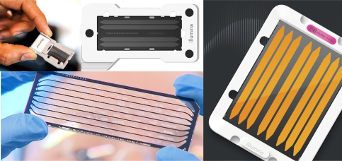
```

--- bg:white

## Cluster generation

```{r, out.width = "70%", dpi = 300, echo = FALSE, fig.align = "center"}
  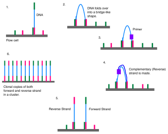
```

--- bg:white

## Sequencing by synthesis

```{r, out.width = "100%", dpi = 300, echo = FALSE, fig.align = "center"}
  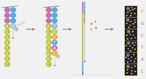
```

--- bg:white

## Data analysis (in the machine)

```{r, out.width = "85%", dpi = 300, echo = FALSE, fig.align = "center"}
  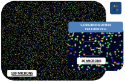
```

---

## What do we sequence?

[Not an exhaustive list]

- **Whole genome resequencing (pure DNA sample from a single individual)**
- Reduced representation genome data (RADseq, targeted SNPs, single individual)
- Poolseq (multiple individuals)
- Transcriptome (RNA sample from single tissue/individual)
- Metabarcoding (PCR amplicon, multiple individuals/species)
- Metagenomics (whole genomes, multiple individuals/species)

--- &twocol

## Whole genome resequencing

*** =left

- Sequencing reads mapped to an existing **reference genome**
- Easy to identify SNPs relative to reference, and to other samples
- Accuracy depends on the number of reads in the stack, termed **depth** or **coverage**

*** =right

```{r, out.width = "80%", dpi = 300, echo = FALSE, fig.align = "center", fig.cap=""}
  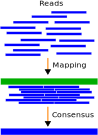
```

---

## Whole genome resequencing

```{r, out.width = "100%", dpi = 300, echo = FALSE, fig.align = "left"}
  include_graphics("./assets/img/Screenshot from 2022-09-08 13-58-44.png")
```

---

## Example: leopard population genomics

```{r, out.width = "100%", dpi = 300, echo = FALSE, fig.align = "left"}
  include_graphics("./assets/img/leopar_res.svg")
```

*Paijmans et al. 2021. Current Biology*

---

## Illumina summary

- The current market leader
- Massive output
- **But keep an eye on Ultima Genomics**
- High accuracy
- Many applications (genome resequencing, RADseq, transcriptomes, metabarcoding)
- Cheap (£9 per Gb)
- Major limitation is the read length
- Unsuitable for assembly of reference genomes

--- .segue .dark 

## Third generation sequencing

--- bg:white

## PacBio

```{r, out.width = "100%", dpi = 300, echo = FALSE, fig.align = "center", fig.cap=""}
  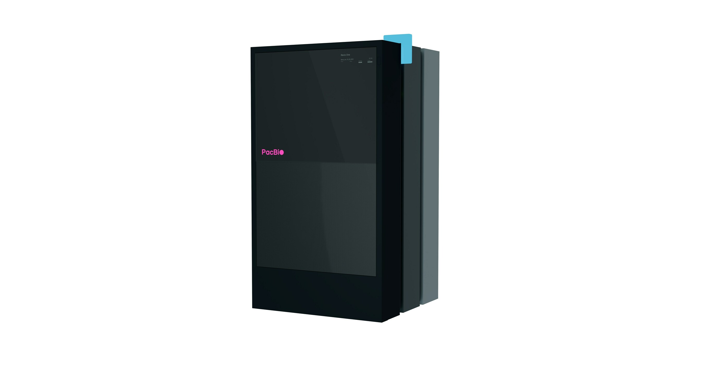
```

--- bg:white

## Single Molecule, Real-Time (SMRT) sequencing

```{r, out.width = "100%", dpi = 300, echo = FALSE, fig.align = "center"}
  include_graphics("./assets/img/smrt_seq.svg")
```

--- 

## HiFi reads

```{r, out.width = "100%", dpi = 300, echo = FALSE, fig.align = "center"}
  include_graphics("./assets/img/HiFi-reads-img.svg")
```

---

## PacBio summary

- Single molecule sequencing (no cluster generation)
- Long reads (around 25 kb)
- 75 Gb per SMRT Cell for Revio
- Fantastic for **assembly of reference genomes**
- Historically high sequencing error, solved by HiFi sequencing
- Still more expensive than Illumina (~£3k per SMRT cell with library prep) 
- Price falling rapidly

---

## What can we do with the data?

```{r, out.width = "100%", dpi = 300, echo = FALSE, fig.align = "left"}
  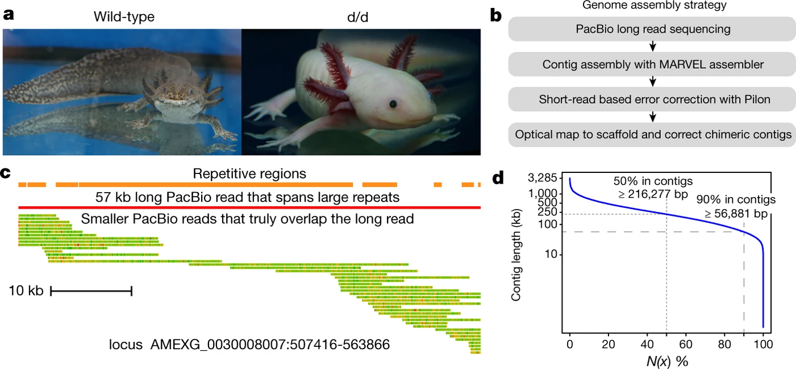
```

*Nowoshilow et al. 2018. Nature*

---

## Oxford Nanopore

```{r, out.width = "100%", dpi = 300, echo = FALSE, fig.align = "left", fig.cap=""}
  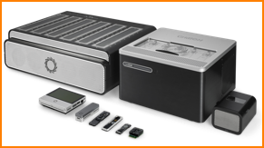
```

--- bg:white

## How it works

```{r, out.width = "90%", dpi = 300, echo = FALSE, fig.align = "left"}
  include_graphics("./assets/img/ont-sequencing_yourgenome.png")
```

---

## Field based sequencing

```{r, out.width = "65%", dpi = 300, echo = FALSE, fig.align = "left"}
  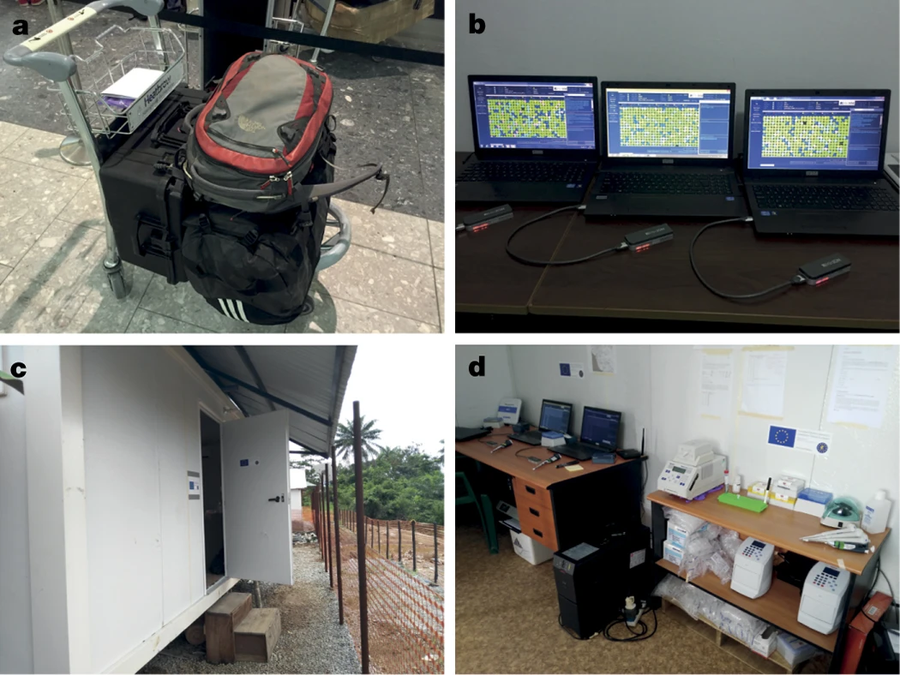
```

*Quick et al. 2016. Real-time, portable genome sequencing for Ebola surveillance. Nature*

---

## Oxford Nanopore summary

- Variable output, up to Tb's with larger platforms
- Long reads, record is 2.3 Mb!
- Output 20-30 Gb (up to 50 Gb) per Minion flow cell
- High error rate, currently 5-10 % but improving
- Still more expensive than Illumina and PacBio (~£750 for Minion flow cell and library prep)
- True portability and real time sequencing/analysis
- But need to buy sequencer: Minion £4,650 inc. 5 flow cells

---

## Recommended reading

```{r, out.width = "100%", out.height=500, dpi = 300, echo = FALSE}
include_graphics("./assets/img/Illumina Inc - 2013 - Illumina Sequencing Technology - YouTube.pdf")
```

---

## Recommended reading

```{r, out.width = "100%", out.height=500, dpi = 300, echo = FALSE}
include_graphics("./assets/img/Hu et al. - 2021 - Next-generation sequencing technologies An overview.pdf")
```

---

## Recommended reading

```{r, out.width = "100%", out.height=500, dpi = 300, echo = FALSE}
include_graphics("./assets/img/Athanasopoulou et al. - 2022 - Third-Generation Sequencing The Spearhead towards the Radical Transformation of Modern Genomics.pdf")
```

--- &thankyou

## Next time:

**Gene trees and molecular dating**
